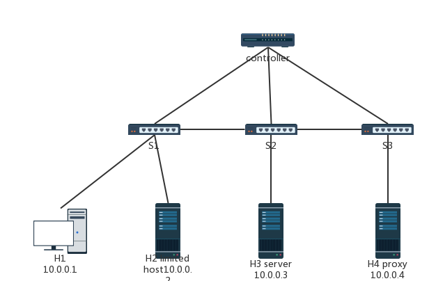

# 高级网络协议大作业
forked from [ysywh/match](https://github.com/ysywh/match.git)

**访问限制&&访问代理功能实现**
- 实现访问限制功能 当主机1ping主机2时，第一次ping之后60s禁止访问
- 实现访问代理功能 主机1作为代理主机 在访问10.0.0.3时 请求会被分发到代理服务器10.0.0.4 而10.0.0.2作为正常主机 访问10.0.0.3时 请求会直接发到10.0.0.3 而不是到10.0.0.4

topo3为此次任务的mininet拓扑 mission.py为实现此次任务的代码

拓扑图如下：

> todo: 利用北向API实现一些web操控的后台管理功能